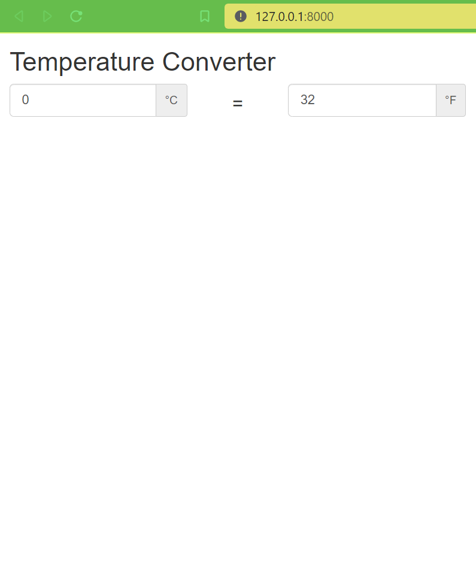

# Temperature Converter

This is a simple Flask app that allows a user to convert between Celsius and Fahrenheit temperatures.

(I chose Flask since we use that as well for our RESTful API from my previous company.)

### Installation

(I'm working using WSL so the links below redirect to the Microsoft docs, but the commands are pretty much the same as Linux since that's the beauty of working with WSL.)

1. [Install Python, pip, and venv.](https://docs.microsoft.com/en-us/windows/python/web-frameworks#install-python-pip-and-venv)
2. [Create a virtual environment.](https://docs.microsoft.com/en-us/windows/python/web-frameworks#create-a-virtual-environment)
3. Run `pip install -r requirements.txt` to install all the necessary dependencies.

If you check `requirements.txt`, you can see the libraries we use to easily make the app: `Flask-Bootstrap` for creating the frontend, `Flask-Limiter` for rate limiting endpoints, `Flask-RESTful` for making REST APIs, `gunicorn` for easier deployment, and `pytest` for our tests.

### REST API

To run the app locally, run `gunicorn app:app` and you should have the app in http://127.0.0.1:8000.

#### Web app

If you go to the base URL using the browser, you'll see 2 input fields for the respective temperature units. Each time you type on the input, the API gets called and the resulting conversion gets displayed on the opposite input field.



You can also directly call the API via cURL as seen below.

#### Celsius to Fahrenheit

```
$  curl 'http://127.0.0.1:8000/convert/' -H "Content-Type: application/json" --data '{ "value": 123, "desired_unit": "F"}'
{
    "result": 253.4
}
```

#### Fahrenheit to Celsius

```
$  curl 'http://127.0.0.1:8000/convert/' -H "Content-Type: application/json" --data '{ "value": 253.4, "desired_unit": "C"}'
{
    "result": 123.0
}
```

Note that we're using POST for our convert endpoint since we're kinda creating a new resource in the sense that it's a different temperature unit.
This is implied with our cURL but if you try to use GET explicitly, it should error:
```
curl 'http://127.0.0.1:8000/convert/' -X GET -H "Content-Type: application/json" --data '{ "value": 0
, "desired_unit": "F"}'
{"message": "The method is not allowed for the requested URL."}
```

#### Rate Limit

Given that the endpoint could easily be abused, a rate limit of 10 per minute is added. The limit should be just enough such that it doesn't  disrupt the user experience on the frontend side.

After spamming the endpoint at some time, it would return a code 429 with the rate limit message.

```
$ curl 'http://127.0.0.1:8000/convert/' -H "Content-Type: application/json" --data '{ "value": 253.4, "desired_unit": "C"}'
{"message": "10 per 1 minute"}
```

### Testing

Basic tests are added and can be seen in `tests/test_app.py`.

```lang=sh
$ python3 -m pytest
======================================================== test session starts ========================================================
platform linux -- Python 3.8.10, pytest-7.1.2, pluggy-1.0.0
rootdir: /home/kmarquez/temperature-converter
collected 3 items

tests/test_app.py ...                                                                                                         [100%]

========================================================= 3 passed in 0.04s =========================================================
```

### Deployment

We've deployed the app in https://temperature-converter-flask.herokuapp.com/ using Heroku since it's free. You can see the steps done in [Getting Started with Python](https://devcenter.heroku.com/articles/getting-started-with-python).

The cURL should be the same except it now points to the heroku app:
```
$ curl 'https://temperature-converter-flask.herokuapp.com/convert/' -H "Content-Type: application/json" --data '{ "value": 0, "desired_unit": "F"}'
{"result": 32.0}
```
